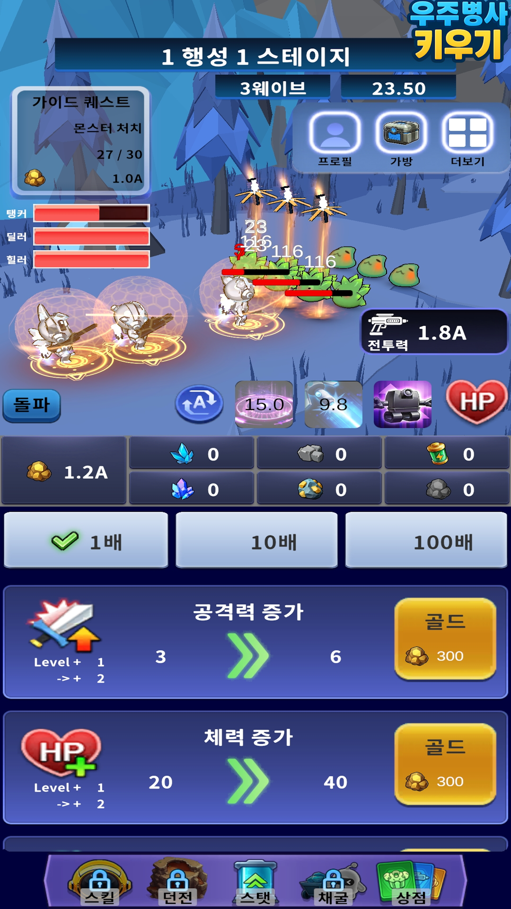
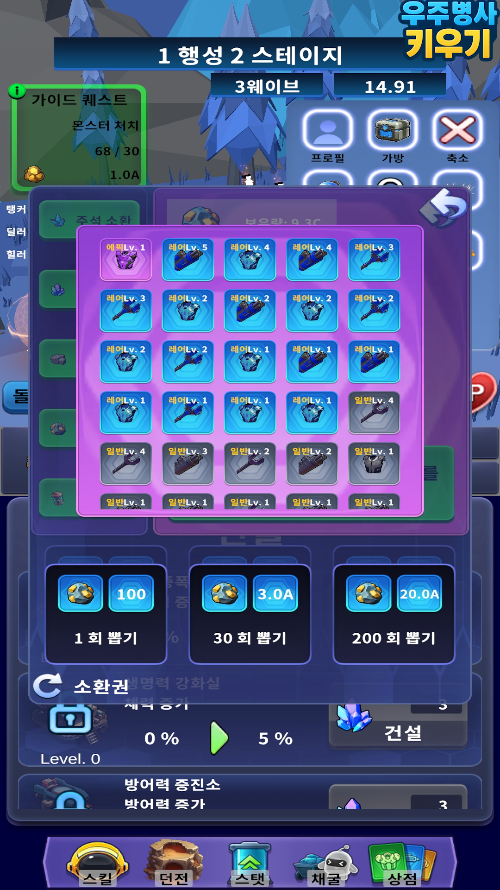
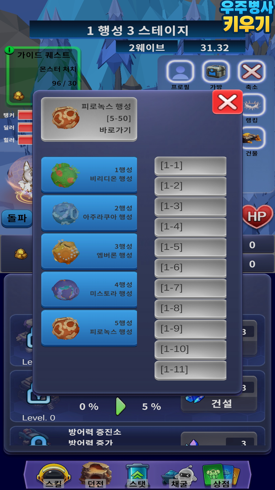
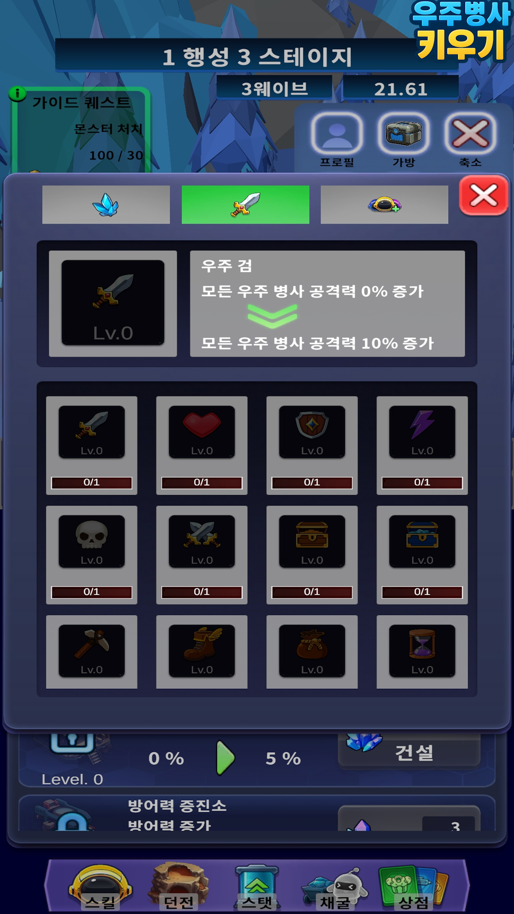
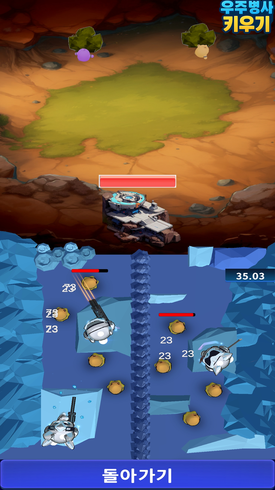
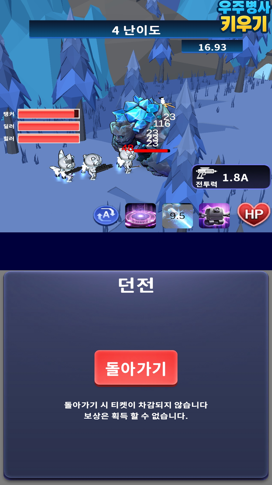

# 우주 병사 키우기

🛠️ **개발 도구**

 

📅 **개발 기간**

2025.03.20 ~ 2025.05.19 (9주)

💂‍♂️ **팀 구성**

 - 개발 : 박지광, 설현기, 황규영
 - 기획 : 이민서, 정연수, 권도형
 
👉 [구글 플레이스토어 출시](https://play.google.com/store/apps/details?id=com.KyungIl.TrainingSpaceSoldier)

방치형 게임 우주 병사 키우기 프로젝트입니다.
**레드 키우기**, **스페이스 마린 디펜스**의 리소스를 활용했습니다.

---

## 📷 스크린샷

